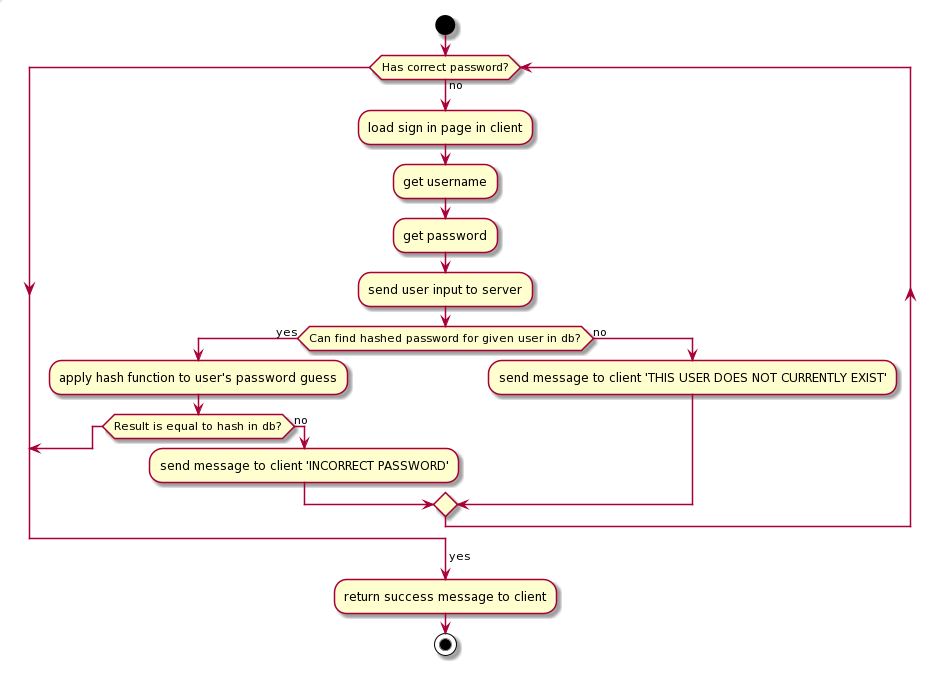

# 23rd September 2020

## Morning

### UML Diagrams

UML is actually a bonafide language you can write to create diagrams. It was developed in 1994 ish by Grady Booch, Ivar Jacobson and James Rumbaugh at Rational Software

*categories of UML diagrams*

- Behaviour
- Structure
- Interations

*types of UML diagrams*

- Activity diagram
- Sequence diagram
- Static Class Diagram
- Relational Data Model

To begin a uml diagram, you write it inbetween two lines like so:
```
@startuml diagram name

...stuff

@enduml
```

*actors* are used to represent given users that intereact with the system

`;actor;` is used to represent a user

`--` is used to make links between entities

`-->` is use to make arrows between entities

###### Class Diagram relationships
`<|--` Extension *inherits class properties, but does not have a parent-child relationship*

`*--` Composition *belongs to a parent but can exist independantly*

`o--` Aggregation *belongs to a parent class and cannot exist without the parent*

Classes can be created using curly bracket

###### Relational database diagrams (ERD)
`!define table(x) class x << (T, #FFAAAA)` function to define that a table can be created as below:

```
table(table_name) {
...
}
```

`}--` one-to-many crow's foot
`}--{` many-to-many crow's foot

##### Case Study: Checking a hashed password
1. Load sign in page in client
2. User enters passsword
3. Send password to server
4. Can get hashed password from db?
5. If no, send message to client USER CANNOT BE FOUND (END)
6. If yes, continue
7. Apply hash function to password guess
8. Is return value equal to hashed value in db?
9. If equal, return success (END)
10. If not equal, return fail, go back to 1


###### UML implementation - activity diagram
```
@startuml verify hashed password
 start
 while (Has correct password?) is (no)
       :load sign in page in client;
       :get username;
       :get password;
       :send user input to server;
       if (Can find hashed password for given user in db?) then
            ->yes;
            :apply hash function to user's password guess;
            if (Result is equal to hash in db?) then
                break
            else
                ->no;
                :send message to client 'INCORRECT PASSWORD';
            endif
       else
            ->no;
            :send message to client 'THIS USER DOES NOT CURRENTLY EXIST';
    endif
endwhile
        ->yes;
        :return success message to client;
        stop

@enduml
```

What it looks like:




## Afternoon

### Design
#### Things to consider
- What the client wants it to look like
- Assessbility
- Limitations of the tools used
- Easy to use
- Simple, intuitive directives
- Good use of space
- What appeals to the target audience
- Visually appealing


*The Design of Everyday Things - Don Norman*


*the design process and scope varies depending on which development cycle you use*


##

__output = designs and diagrams for software plans__