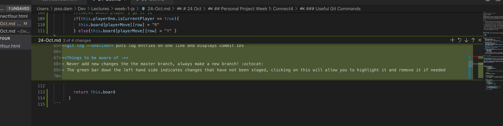

# 24 Oct
## Personal Project Week 1: Connect4

(sourced from CodeWars)
### Task

The game consists of a grid (7 columns and 6 rows) and two players that take turns to drop their discs. The pieces fall straight down, occupying the next available space within the column. The objective of the game is to be the first to form a horizontal, vertical, or diagonal line of four of one's own discs.

Your task is to create a Class called Connect4 that has a method called play which takes one argument for the column where the player is going to place their disc.

### Rules

* If a player successfully has 4 discs horizontally, vertically or diagonally then you should return "Player n wins!” where n is the current player either 1 or 2.

    * There must be two players that can play against one another

* If a player attempts to place a disc in a column that is full then you should return ”Column full!” and the next move must be taken by the same player.

* If the game has been won by a player, any following moves should return ”Game has finished!”.

* Any other move should return ”Player n has a turn” where n is the current player either 1 or 2.

* Player 1 starts the game every time and alternates with player 2.

* The columns are numbered 0-6 left to right.


### Project Tasks
Steps for versions created using MVP making test-based goals

* | O O O
* | O O O
* | O O O


#### Version 1 - Noughts and Crosses 3 x 3 version
* [x] **Setup**
    * [x] Make new game instance
    * [x] Display 2D array with no moves
    * [x] Define Player 1 and 2 - assign counter color

* [x] **Allow a player to enter counter based on column number**
    * [x] Get player 1 input
    * [x] Check if column is available
    * [x] Display player's counter in array
    * [x] Return appropriate message for when column number is invalid
    * [x] Show changes to board

* [x] **Check player 2 can also enter counters identifiable from player 1**
    * [x] Display player 2's counter in array

* [ ] **Validation of Win / Endgame**
    * [ ] After both players have had 4 goes, check if either have won
        * [ ] Check horizontal
        * [ ] Check vertical
        * [ ] Check diagonals

    * [ ] Given that a player has got four in a row, display message with winning player
    * [ ] Given that the board is full, and no person has got a row of four


### Useful Git Commands

**git log --oneline** puts log entries on one line and displays commit IDs

**Things to be aware of :**
* Never add new changes the the master branch, always make a new branch! :octocat:
* The green bar down the left hand side indicates changes that have not been staged, clicking on this will allow you to highlight it and remove it if needed



### What should I do when I want to go back to a previous commit?
* Don't panic too much and save and stage everything you are currently doing (even if it's bad code)
* Commit to the current branch **git commit -m 'some message'**
* Copy the long commit ID reference for the commit you want to go back to from **git log** and paste it into terminal after git checkout to create a detatched temporary branch that at that commit in the history (e.g. **git checkout 703536a888841c18d77febd464ba3472e9089cf**c)
* Now call this branch a new name by typing **git checkout -b <branchName>**
* Check the branches with **git branches**
* Delete and prune the old branch
    *
    git branch -d branch_name *deletes local branch*
    git push <remote_name> --delete <branch_name> *deletes remote branch*
    git remote prune origin --dry-run *checks what remote branch references can now be removed*
    git remote prune origin *prunes references*
    git branch -a *see what branches are local*

    **how to remove remote references?**


``` js
 getPlayerMove(playerMove){
        let validMove = false
        while (!validMove){
          if(isValidMove(playerMove)){
            validMove = true
          }
          else{
            console.log(`You can't go there! Please enter a number from 1 to ${this.board[0].length}`)
          }
        }
        makeAMove()
        return parseInt(playerMove)
      }

      isValidMove(playerMove){
        // checks that player input is bigger than 0 and smaller or equal to number of columnss
        return (playerMove <= this.board[0].length) && (playerMove > 0) ?
          true : false
      }

      makeAMove(playerMove){
        //adds player move to board in next available row
        let spaceFound = false
        let row = 0
        while(!spaceFound){
          (this.board[row] == 0) ?
            spaceFound = true : row++
        }

        //checks which player's go it is
        if(this.playerOne.isCurrentPlayer == true){
          this.board[playerMove][row] = "R"
        } else{this.board[playerMove][row] = "Y" }

        return this.board
      }
```